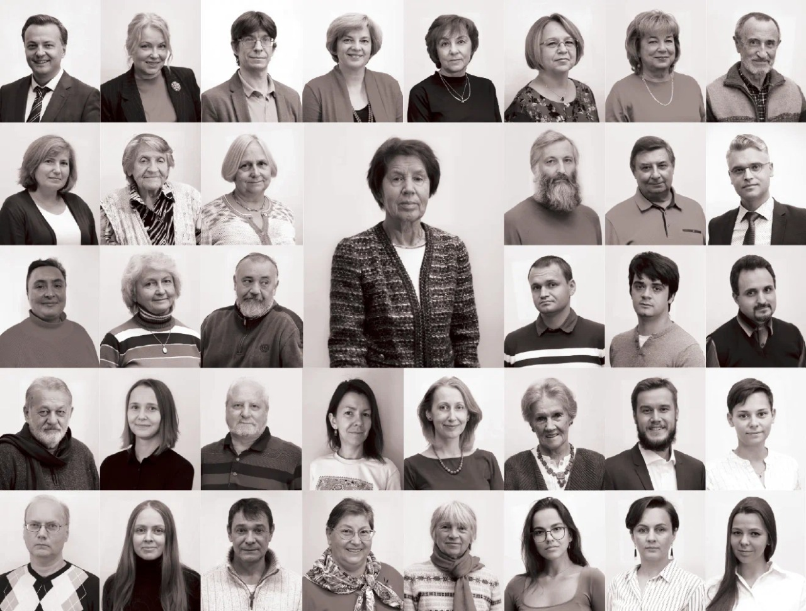
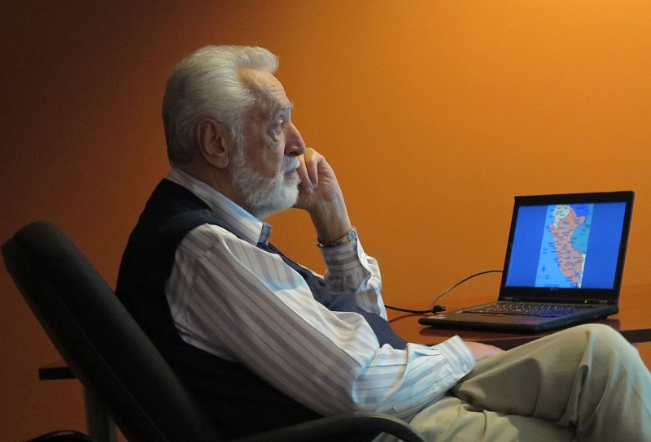
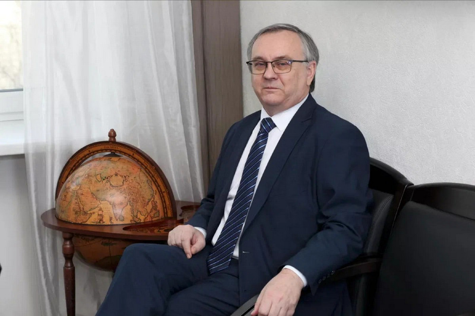
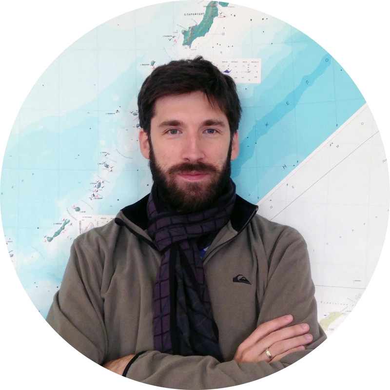

> [Геоград 2022 90 лет кафедре картографии и геоинформатики МГУ (бывшей геодезии и картографии)!](www.facebook.com/Geograd/posts/90-лет-кафедре-картографии-и-геоинформатики-мгу-бывшей-геодезии-и-картографии-по/206325485098875/)

Поздравления кафедре от её известных выпускников: зав. каф. в 1990-2009 гг. А.М. Берлянта, ректора Саратовского национального государственного исследовательского университета имени П.Г. Чернышевского А.Н. Чумаченко и зав. отделом картографии и дистанционного зондирования Земли ИГ РАН А.А. Медведева.

### Александр Михайлович Берлянт, д.г.н., профессор

Зав. кафедрой картографии и геоинформатики в 1990–2009 гг., Заслуженный профессор Московского университета, Заслуженный деятель науки РФ, выпускник кафедры 1962 г.

Кафедра отмечает важную дату — 90 лет честного и плодотворного труда во благо прекрасной древней науки — картографии. Сегодня кафедра картографии и геоинформатики — это крупный научно-образовательный центр России, известный передовыми достижениями в области атласного и комплексного тематического картографирования.

За века существования картография кардинально изменила свой язык, графические средства, общий стиль и облик. Но и сегодня карта, опирающаяся на геоинформатику и дистанционное зондирование, остается наглядной уменьшенной моделью мира. Это великое изобретение человеческого гения продолжает быть особым средством познания в науках о Земле и планетах. Так будет вечно, пока человек получает информацию с помощью зрения.

Современным картографам и геоинформатикам Московского университета есть чем гордиться и есть к чему стремиться. Они учились у прекрасных, мудрых учителей и сегодня продолжают великие традиции российской картографической школы. Прогресс науки бесконечен, и молодые талантливые выпускники кафедры картографии и геоинформатики готовы встать на службу своей стране и приумножить ее славу.

### Алексей Николаевич Чумаченко, д.г.н., профессор

Ректор Саратовского национального государственного исследовательского университета имени П.Г. Чернышевского, Почетный работник высшего профессионального образования РФ, выпускник кафедры 1986 г.

Мне посчастливилось учиться у замечательных преподавателей, великолепных ученых, прекрасных людей. Непререкаемый авторитет, великий Константин Алексеевич Салищев; сильный и целеустремленный, создатель геоинформационного направления Сергей Николаевич Сербенюк; мудрый и ироничный Александр Михайлович Берлянт; добрейший человек, фронтовик, прошедший всю войну, Олег Александрович Евтеев; благодушный и улыбчивый Юрий Фирсович Книжников; молодой и талантливый Владимир Сергеевич Тикунов; энергичная и яркая Валентина Ивановна Кравцова; артистичный, любимец первокурсников Владимир Святославович Кусов; строгая и справедливая Анна Васильевна Востокова; душа компании и друг всех студентов Юрий Викторович Свентэк; интеллигентная и внимательная Ирина Алексеевна Лабутина; деликатный, скромный Балис Балио Серапинас; обаятельная светлая Елена Алексеевна Божилина; жизнерадостная и заботливая Татьяна Григорьевна Сваткова; большой и незаурядный Владимир Тихонович Жуков. Они все разные. И все они мои Учителя. Среди них и мой научный руководитель — дорогой и любимый человек, сделавший для меня очень много, — Богуслав Августович Новаковский. Все последующие годы я был причастен к жизни кафедры — аспирантура, докторантура, общие проекты… Но все же самые яркие воспоминания — это воспоминания студенческих лет.

Сейчас кафедра другая. Она заметно моложе. А значит, есть реальные перспективы для развития. Этого и хочется пожелать. Наша кафедра, кафедра картографии и геоинформатики, всегда была лучшей на факультете. Ну, по крайней мере, мы, картографы, так всегда считали. Пусть так будет и впредь.

### Андрей Александрович Медведев, к.г.н.

Заведующий отделом картографии и дистанционного зондирования Земли Института географии РАН, выпускник кафедры 2005 г.

Свои воспоминания о любимой кафедре могу разделить на 4 части: студенческие годы; практики и зимние экспедиции; преподавание на кафедре; общественная жизнь. Студенческая жизнь — это всегда буря эмоций, которые ни с чем не сравнить! При этом любой географ скажет, что самое лучшее в обучении на факультете — это практики! Кафедральные практики — это отдельный сюжет, их никогда не забыть. От работы с приборами до многокилометровых маршрутов, от ночных отчетов до уютных костров, от вагона поезда до защиты практики.

Когда становишься преподавателем на кафедре, жизнь переворачивается. Ты должен держать планку университета и кафедры, а планка эта установлена очень высоко. Всегда хочется научить студентов чуть большему, чем знаешь сам: дать то, что тебе не хватало, когда ты был студентом. Отдельно вспоминаешь зимние экспедиции НСО, в которых участвовал уже в статусе преподавателя — безынициативных там нет! Все работают одной командой, генерируют идеи, устраивают «Картографический Новый год», делают настоящее научное исследование. Те, кто ездил в НСО, — дважды проверенные и надежные люди.

Картографы всегда были отдельной кастой на факультете. И после его окончания это тоже отдельное сообщество, с которым регулярно контактируешь уже в рамках работы или общих интересов. Выпускники кафедры всегда отличались педантичностью, слаженностью и ответственностью. В работе картографы такие же — четкие, слаженные, предприимчивые. Спустя много лет после окончания кафедры ее выпускники в жизни — отзывчивые, понимающие, верные друзья, за которых не стыдно в любые времена.

---

Материал подготовлен Ириной Константиновной Лурье, д.г.н., профессор, зав.кафедрой картографии и геоинформатики, Тимофеем Евгеньевичем Самсоновым, к.г.н., вед.н.с., зам.зав. кафедрой картографии и геоинформатики по научной работе.
