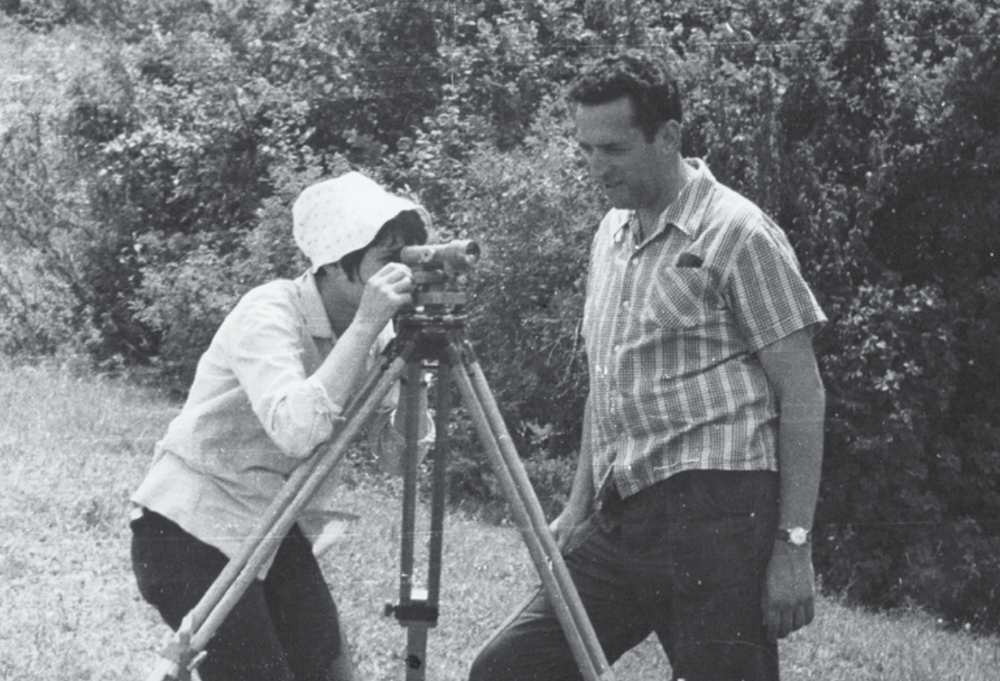

> Сатино. 70 — 80-е годы / А. М. Берлянт [«GeograpH» № 4 (43), 2018](https://www.geogr.msu.ru/about/geograph/Geo_43.pdf)

Александр Михайлович БЕРЛЯНТ,
д. г. н., профессор, заслуженный деятель науки РФ,
заведующий кафедрой картографии и геоинформатики в 1990–2009 гг.

Конечно, практика — не экспедиция, но быт почти полевой, свободный, в солнечной долине Протвы, в грибном лесу, в жару или посреди затяжных дождей. Зимние проблемы остались в Москве. Свежий лес в конце мая только оживает к лету, и мы окунаемся в него после московской нервотрепки и сутолоки. Он пахнет сыростью мокрых корней и прошлогодних листьев, устилающих скользкие тропинки. Дурманит сладкий запах медоносов, аромат цветущей липы и молодых трав. Распустились ландыши, стоит умопомрачительный для городского жителя запах черемухи и сирени. Лирическое и беспечное настроение исходит от свежих кустарников, покрытых зеленой пеной. Начало лета оптимистично, кажется, что небо всегда будет прозрачно, свежо и чисто. Но к середине июня часто наступают холода, студенты мерзнут.

Картографы приезжают первыми, вместе с геоморфологами — мы открываем цикл общегеографических практик: полкурса у нас и полкурса у них, потом меняемся. Во второй декаде июня, когда топография подходит к мензульным работам, начнутся дожди. Геоморфологи шутят: картографы взялись за планшеты, значит, быть дождю.

Сатинская база заложена в 1968 г. Впервые я приехал туда в следующем году и потом ездил ежегодно в течение почти 40 лет. В первые два года база еще не была построена, для столовой арендовали небольшой зал школы пчеловодства, а рядом разбили студенческий палаточный лагерь. На следующий год поставили большую палатку для временной столовой и кухни. Преподаватели снимали комнаты в деревне. Сатино в то время было умирающей деревней с двумя десятками жителей, большинство из которых были стариками. На большой поляне за оврагом, где теперь студенческий лагерь, стоял простенький памятник со звездочкой жителям деревни, погибшим в Великую Отечественную. Потом памятник перенесли к клубу, ближе ко въезду в деревню. Хотели красиво оформить, но вышло бедно, непрочно, обелиск быстро разрушался, «получилось как всегда». В 1990-е годы к пропадающим в бедности и одиночестве деревенским бабушкам «понаехали» московские «племянники», скупили их избушки, соорудили заборы, построили дачки, привозили на лето ребятишек, чтобы дышать чистым сатинским воздухом, собирать грибы и ягоды…

Первыми преподавателями, выбравшими место для учебной базы, были Александр Владимирович Брюханов, энтузиаст здешних мест, и Евгений Евгеньевич Ширяев. Они разбили хорошую учебную опорную сеть, поставили и наблюдали учебные пирамиды, работать стало вполне удобно. Но с середины 1990-х годов началась бойкая продажа участков дачникам, и живописные склоны Протвы оказались разгорожены заборами, были построены небольшие и весьма большие дачки, что стало мешать геодезическим съемкам и геоморфологическим маршрутам. Факультет в свое время не закрепил за собой эти земли, считалось, что они всегда будут «ничейными», но вдруг оказалось, что это совсем не так.

Строительство базы началось со столовой и преподавательского дома. Однажды мне поручили отмерить место для будущей базы между восточным и западным оврагами до поймы и от реки до школы пчеловодства, а затем начертить простенькую схему. Задача была несложная, я проложил замкнутый теодолитный ход по склону между двумя глубокими оврагами, впадавшими в Протву, с севера наметил линию почти параллельно подножию склона, а с юга — через заброшенный скотный двор и деревянный туалет. Закрепил углы поворотов колышками, измерил углы, вычертил схему, получился почти правильный четырехугольник. Именно по этим линиям будущий лагерь обнесли изгородью из сетки рабицы на бетонных столбах, так что мне есть чем гордиться: ограда поставлена по моему чертежу.

Вначале построили дом для преподавателей и камеральный корпус. Двухэтажное здание с большими окнами и балконами по фасаду, возможно, подошло бы для южного курорта, но для средней полосы России оно было малопригодно даже летом. Дом строили в год, когда резко поднялись цены на стройматериалы, факультет не располагал необходимыми средствами, поэтому встал вопрос: заморозить строительство на неопределенный срок или чем-то пожертвовать. Пожертвовали отоплением. В результате зимой здание промерзало, летом отсыревало, первый этаж был сырым, штукатурка отваливалась, трубы гнили. В довершение всего, во всю переднюю стену располагались окна. Комнаты преподавателей были холодными, продуваемыми, лишь в жаркие дни это было терпимо. Кроме того, стеклянный по фасаду дом отлично просматривался, студенты называли его «цветным телевизором», преподаватели занавешивали окна шторами. Без отопления был построен и большой кирпичный камеральный корпус, там тоже с первого же года потребовался ремонт.

Столовая была сделана хорошо: большое одноэтажное помещение с отдельным залом для преподавателей. Довольно просторная кухня, здесь работали университетские повара, они дорожили возможностью приезжать в Сатино, проводить все лето с семьями. Помню, как на практику приехал декан А.М. Рябчиков. Над дверями столовой его встретил плакат: «Ешь ананасы, рябчиков жуй!»

Чертеж участка под строительство Сатинской базы и место базы в границах
землепользований первых лет.
Рисунки предоставлены А.А. Сучилиным

Еще был выстроен большой санблок из красного кирпича, сразу окрещенный «мавзолеем». Ну и, конечно, главная часть базы — ряды десятиместных армейских брезентовых палаток размером 4,5 х 4,5 м и высотой около 1,7 м, стоявших на деревянных настилах и амфитеатром спускавшихся к долине. Я уже завершал свою преподавательскую деятельность, когда сатинский лагерь приобрел новый облик. Поставили деревянные домики, приподняв их на метр от земли, вокруг — некое подобие терраски, крылечко. Думаю, мало, где в стране есть такая комфортная база для проведения полевых практик, как на нашем географическом факультете.

Жизнь на практике — не отдых, а довольно напряженная работа, обычно с девяти утра и до позднего вечера. Хотя по сравнению с зимним бытом на факультете — это, конечно, отдых и полная разрядка. Все идет по плану, отработанному за многие годы.

Прокладываем теодолитный ход, измеряем вертикальные и горизонтальные углы, промеряем расстояния. Сатинский полигон очень удобен, почти идеален для практики: много открытого пространства, разные угодья, интересный для съемки рельеф. Потом начинаются вычисления в камералке, идут нивелировки по профилю и напоследок — мензульная съемка местности, рисовка рельефа и ситуации (самый ценный для географа момент топографической практики), применение GPS, дешифрирование и др.

У картографов «центральным человеком» был Юрий Викторович Свентэк. Он любил Сатино не меньше всех нас и был самым компанейским преподавателем на практике. А потом он приезжал в Сатино в сентябре и октябре по грибы, ему нравилось посидеть на опушке на Соколихе. Умел собирать грибы, знал места, где среди молодых сосенок всегда после дождя появлялись маслята. Он вкусно их жарил и умел солить молодые огурчики.

— Приходи, попробуем огурчики, очень вкусные получились.
— Что, неужели так быстро успели засолиться?
— Да не знаю, очень попробовать хочется.

Он ловко растирал в стакане растворимый кофе с сахаром: так, что когда зальешь кипятком, получится пенка, как у капучино. Двери его комнаты никогда не закрывались, все молодые преподаватели и стажеры, профессора Сергей Николаевич Сербенюк и Богуслав Августович Новаковский запросто заходили к нему покурить и попить кофе. Еще он умело рассказывал смешные истории и анекдоты из сатинской жизни, сочинял стихи. В нем было очень доброе лукавство и артистичность.

Стараниями Юрия Викторовича была организована компьютеризация практики, и трудоемкое уравнивание теодолитного хода, составление тахеометрического плана и тому подобная обработка наблюдений избавились от сложных и долгих вычислений. Свентэку помогали Владимир Семин, Александр Сучилин, Сергей Кошель — молодые сотрудники лаборатории автоматизации кафедры картографии. Потом пришла очередь внедрения GPS, энтузиастами стали Александр Сучилин, Али Аляутдинов, Аскар Ильясов, Анна Репина. Постепенно топографическая практика оснастилась современными технологиями.

Среди преподавателей всегда есть человек, возле которого концентрируются другие, эпицентр компании, можно сказать, заводила. Таким был профессор Лев Георгиевич Никифоров, заведующий кафедрой геоморфологии, умный, опытный человек, с хитринкой, как и следует быть заведующему. Он возглавил кафедру по рекомендации прежнего заведующего, профессора О.К. Леонтьева, корифея морской геоморфологии. Лев Георгиевич был человеком чрезвычайно общительным, контактным, с лукавой насмешливостью. Держался независимо, выглядел грубовато, хотя на самом деле был очень доброжелателен. Главное его качество — умение быть лидером в научной работе, во всяком профессиональном споре, в застолье, на волейбольной площадке, в умении заваривать чай. Умел пошутить, никого не обижая, — с ним всегда было приятно. Он вырос на Полянке и, кажется, навсегда сохранил повадки дворового мальчишки из центра Москвы.

Вокруг Никифорова собиралась дружеская компания: лаборантки Люба и Лариса (инженеры кафедры геоморфологии и палеогеографии Л.М. Белковская и Л.Д. Бычкова — прим. ред.), аспирант и энтузиаст Сережа Болысов, тогда еще молодой аспирант (теперь — профессор), многие картографы. Мы отправлялись вечерами на ту сторону Протвы, в урочище Соколиха на поляну у опушки. Там разводили небольшой костер, слушали рассказы Льва Георгиевича о рейсах исследовательских судов в Атлантику, Тихий океан, на экзотические острова Океании и Юго-Восточной Азии. Прибаутки, забавные случаи, анекдоты — он любил рассказывать всегда с юмором, подначками. Возникало чувство общности, мы любили его слушать. Текущие дела не обсуждали, вспоминали бессчетные истории, забавные байки, «удивительные» случаи. Понять очарование таких посиделок способны те, кто грел руки у костра, сушил мокрый плащ, пил чай «с дымком».

Возвращались в лагерь за полночь, июньская ночь коротка. Слышно, как раскатываются в липах соловьи. Лагерь спит, точнее сказать, должен спать. С утра начинаются маршруты. Лев Георгиевич жует по пути терпкую веточку можжевельника. Студенты шепчутся: «Наш-то — джином балуется».

Лев Никифоров был прекрасным организатором, он поставил отличную практику, собрал и сдружил коллектив профессионалов-преподавателей. В сатинском быту он был очень доступным, дверь его комнаты никогда не запиралась, чай всегда был крепко заварен. С ним можно было обсудить любую тему, он умел слушать, вникать и если нужно — дать откровенный и полезный, порой резкий совет. Жизнь обошлась с ним сурово. Случился сердечный приступ, а потом что-то вроде инсульта, он почти потерял речь. Но летом по-прежнему ездил в Сатино, помогал сотрудникам, рисовал сатинские пейзажи: Протву и лес, где много сочного зеленого цвета. Он ушел из жизни молодым.

Среди геоморфологов тех лет были очень яркие люди: профессор Сергей Сергеевич Воскресенский, подтянутый и бывалый полевик, всегда ходивший в солдатских сапогах, профессора Алексей Иванович Спиридонов, Юрий Гаврилович Симонов — опытные, авторитетные географы-экспедиционники, блестящие преподаватели, более молодые Геннадий Сафьянов, Андрей Бредихин, Сергей Болысов и другие.

После топографии и геоморфологии идут все другие географические практики...

Студенты, заполняющие базу в конце мая — начале июня, впервые впитывают восторженные впечатления от нового места, еще полноводной реки, подвесного качающегося моста, перекинутого на другой берег, от свежей лесной зелени, изумрудной поймы, чистых трелей соловьев, черемухового запаха и опьяняющего воздуха. Студенты и теперь мало изменились, только одеты изысканней и часто приезжают на своих машинах, чего в наши годы совсем не бывало. И песни у них другие. А мальчики и девочки — те же, и все у них случается так же романтично, и они наверняка пишут неумелые стихи, а вечерами идут на пойму — посидеть у костра.

В Москву они вернутся загорелыми второкурсниками. Сколько им еще предстоит! Практика в Сатино запомнится на всю жизнь.
